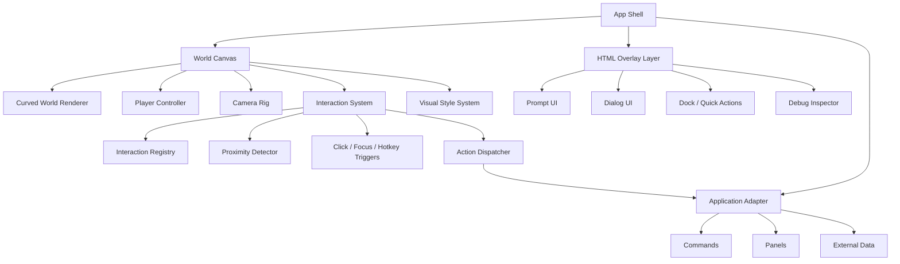
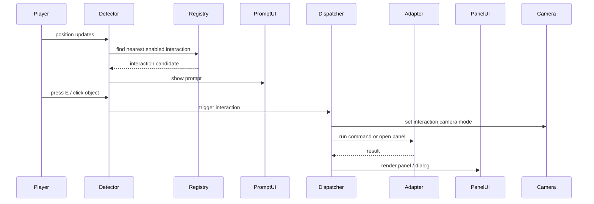

# 3D Product World Interface Implementation Plan

> Working title: **Product World Interface Kit**  
> Document version: 0.2  
> Date: 2026-05-26  
> Goal: Build a reusable 3D web interface foundation that can later connect to different applications: product sites, AI agents, file managers, dashboards, documentation portals, onboarding flows, and experimental desktop-like interfaces.

---

## 1. Product direction

This project is **not** a small browser game. It is a reusable interface layer where product features become places, objects, characters, and rituals.

Examples:

- Customer support becomes a phone booth.
- AI assistant becomes an NPC.
- A pricing page becomes a building.
- A file becomes a box, letter, cassette, suitcase, or delivery crate.
- A workflow becomes a car route, train line, conveyor belt, or small neighborhood.
- A tutorial becomes a guided walk through the world.

The goal is to create a framework where future apps can plug into the same 3D interaction shell.

```txt
Application logic  -> commands, panels, data adapters
Interface metaphor -> NPCs, buildings, vehicles, phone booths, portals
3D world           -> curved planet-like surface, dramatic camera, comic style
User action        -> move, inspect, talk, call, enter, carry, trigger
```

---

## 2. Core visual target

The desired look is:

- Large planet or curved world, not a visible toy globe.
- The page should usually **not reveal the full sphere**.
- The user should feel they are walking on a small strange world with a curved horizon.
- Wide-angle, low-position, high-tension camera.
- Rough, simple, bold American-comic-inspired look.
- Not polished sci-fi UI. More like expressive, imperfect, high-contrast, hand-made interface energy.
- Strong silhouettes, chunky geometry, exaggerated proportions.
- NPCs and props should feel clickable and memorable.

Important correction from the first prototype:

```txt
Wrong for this project:
Character fixed in place, planet rotates under character.

Correct direction:
Character moves through a mostly stable world.
Camera follows the character.
The world is visually curved or planet-like, but interaction remains grounded.
```

---

## 3. Recommended MVP scope

The first public GitHub version should not try to become a full desktop replacement. It should prove the interface system.

### MVP must include

1. Large curved world scene.
2. Controllable character.
3. Dramatic third-person camera.
4. Five example interaction points.
5. A reusable interaction registry.
6. A reusable application adapter interface.
7. Overlay UI panel system.
8. Example app adapter: `demo-product`.
9. Extensible config-driven way to add NPCs, props, triggers, and panels.
10. Documentation showing how to add a new interaction point.

### MVP should not include yet

- Multiplayer.
- Full file-system integration.
- Real OS desktop replacement.
- Procedural city generation.
- Complex quests.
- Production-grade physics.
- Heavy custom shader pipeline beyond what is needed for the look.
- Mobile-first virtual desktop workflows.

This keeps the project shippable.

---

## 4. Technical stack

Recommended default stack:

```txt
Vite or Next.js
React
TypeScript
Three.js
@react-three/fiber
@react-three/drei
@react-three/rapier or BVH-based collision
Zustand
GSAP, optional
```

### Stack notes

- Use **React Three Fiber** because the project is component-heavy: NPCs, objects, panels, prompts, camera rigs, world zones, and adapters should all be modular React components.
- Use **Drei** for practical helpers such as loaders, text, environment, camera controls, HTML overlays, and common scene utilities.
- Use **Rapier** if the MVP needs reliable physical collision. For a lighter version, use simple proximity checks and static mesh collision.
- Use **Zustand** for app/world state because the project needs shared state between 3D scene, UI panels, selected interaction, current app adapter, commands, and debug tools.
- Use **WebGL-first**. Do not require WebGPU. WebGPU can be an optional future renderer experiment, but it should not be part of MVP assumptions.

### Vite vs Next.js

Use Vite if the first goal is an open-source interactive component kit.

Use Next.js if the first goal is a product website or SaaS landing page that needs routing, SEO pages, server features, and docs.

Recommended choice for first GitHub version:

```txt
Vite + React + TypeScript
```

Reason: faster setup, fewer framework assumptions, easier for other people to clone and run.

Later, provide a separate example:

```txt
examples/next-app
```

---

## 4A. Open-source components and reference repositories

This project should not build every low-level system from scratch. The goal is to assemble a strong interaction language, not to write a full custom engine.

The recommended strategy:

```txt
Borrow:
- rendering foundation
- character movement baseline
- physics/collision helpers
- asset loading and optimization
- post-processing pipeline
- debug controls

Build ourselves:
- product-world interaction model
- InteractionPoint abstraction
- AppAdapter abstraction
- interaction registry
- spatial UI conventions
- visual style presets
- documentation and examples
```

### 4A.1 Core rendering and React integration

| Package / repo | Link | Use in this project | Recommendation |
|---|---|---|---|
| React Three Fiber | https://github.com/pmndrs/react-three-fiber | Main React renderer for Three.js scenes. Lets us build NPCs, triggers, props, camera rigs, and world modules as React components. | Use as core foundation. |
| Drei | https://github.com/pmndrs/drei | Practical helpers: loaders, text, camera helpers, environment, HTML overlays, shader/material helpers, presentation utilities. | Use heavily, but avoid depending on too many helpers before the architecture is stable. |
| Three.js | https://github.com/mrdoob/three.js | Underlying WebGL rendering library. | Use through R3F for most code, but allow low-level Three.js where needed. |
| Zustand | https://github.com/pmndrs/zustand | Global state between 3D world, selected interaction point, overlay panels, current app adapter, and debug tools. | Use for world/app state. |
| Maath | https://github.com/pmndrs/maath | Damping, interpolation, easing, random helpers. Useful for camera smoothing, object hover motion, UI-ish spatial animation. | Use for camera and interaction polish. |

### 4A.2 Character controller and movement

The biggest early decision is the player controller.

There are two good paths:

```txt
Path A: Rapier-based character controller
Better for: physical interactions, moving props, vehicles, dynamic bodies.
Main candidates: ecctrl + react-three-rapier.

Path B: BVH/static-mesh character controller
Better for: lightweight interactive worlds, portfolios, product sites, static maps.
Main candidates: BVHEcctrl + three-mesh-bvh.
```

| Package / repo | Link | What it gives us | Fit for this project |
|---|---|---|---|
| ecctrl | https://github.com/pmndrs/ecctrl | A ready-made floating rigid-body character controller for React Three Fiber and Rapier. Useful for third-person movement prototypes. | Best first choice for MVP if we want movement quickly. |
| BVHEcctrl | https://github.com/pmndrs/BVHEcctrl | Lightweight character controller using `three-mesh-bvh`, no full physics engine required. | Strong candidate for product-world sites where most geometry is static. |
| react-three-rapier | https://github.com/pmndrs/react-three-rapier | Rapier physics wrapper for R3F. Gives rigid bodies, colliders, sensors/triggers, physical objects. | Use if we need real physics or sensor-based triggers. |
| three-mesh-bvh | https://github.com/gkjohnson/three-mesh-bvh | Accelerated raycasting and spatial queries against Three.js meshes. Good for large static scenes. | Use for collision, picking, and proximity queries in larger worlds. |
| doppl3r/kinematic-character-controller-example | https://github.com/doppl3r/kinematic-character-controller-example | Example of Rapier.js Kinematic Character Controller with Three.js. | Reference only. Useful if ecctrl becomes too limiting. |
| icurtis1/character-controller-sample-project | https://github.com/icurtis1/character-controller-sample-project | R3F + Rapier third-person controller sample with mobile support, physics interactions, and post-processing. | Reference only. Good for studying architecture and mobile handling. |

### Movement recommendation for MVP

Start with this:

```txt
MVP choice:
ecctrl + react-three-rapier

Reason:
Fastest path to real controllable third-person movement.

Keep abstraction:
<PlayerController adapter="ecctrl" />
```

But design the code so this can later switch to:

```txt
<PlayerController adapter="bvh" />
<PlayerController adapter="custom-kcc" />
```

Do not let `ecctrl` leak through the whole codebase. Wrap it behind our own player interface:

```ts
export interface PlayerControllerAdapter {
  getPosition(): Vector3
  getRotation(): Quaternion
  setEnabled(enabled: boolean): void
  teleport(target: Vector3, rotation?: Quaternion): void
  onStateChange?(handler: (state: PlayerMovementState) => void): () => void
}
```

### 4A.3 Camera, controls, and cinematic movement

This project needs a custom camera feel. We can still borrow pieces.

| Package / repo | Link | Use in this project | Recommendation |
|---|---|---|---|
| camera-controls | https://github.com/yomotsu/camera-controls | Smooth camera transitions and richer controls than plain OrbitControls. Drei also wraps this as `CameraControls`. | Useful for debug/free camera and guided shots. |
| three-story-controls | https://github.com/nytimes/three-story-controls | Camera toolkit for interactive 3D stories, including camera rigs and designing camera animations. | Study as reference for cinematic/story camera patterns. Do not depend on it until proven necessary. |
| Maath | https://github.com/pmndrs/maath | Damp camera position, target, FOV, shake intensity, and interaction focus transitions. | Use in custom `CameraRig`. |

### Camera implementation guidance

Build our own camera rig:

```txt
CameraRig
- follows player
- supports wide-angle FOV presets
- supports low-angle dramatic framing
- supports interaction focus mode
- supports temporary cutscene / inspect mode
- supports debug free-camera
```

Use libraries as helpers, not as the architecture.

Recommended camera presets:

```ts
type CameraPreset =
  | "explore-wide"
  | "dialog-close"
  | "object-inspect"
  | "product-reveal"
  | "debug-free"
```

### 4A.4 Post-processing and visual style

The rough comic look should be modular. The first version can be simple: toon materials, black outlines, noise overlay, halftone texture, high contrast UI. Do not block MVP on complex shaders.

| Package / repo | Link | Use in this project | Recommendation |
|---|---|---|---|
| react-postprocessing | https://github.com/pmndrs/react-postprocessing | R3F-friendly post-processing pipeline. Can combine effects more cleanly than manual pass chains. | Use for vignette, noise, outline, chromatic aberration, tilt-shift, or custom effects. |
| postprocessing | https://github.com/pmndrs/postprocessing | Lower-level effect library behind many R3F post-processing workflows. | Use indirectly through `react-postprocessing` unless custom effect work requires direct access. |
| unplugin-glsl | https://github.com/YunYouJun/unplugin-glsl | Import GLSL shader files in Vite/Rollup/Webpack/esbuild projects. | Use only when custom shaders become necessary. |
| Leva | https://github.com/pmndrs/leva | React-first debug GUI. Good for tuning FOV, camera offset, trigger radius, colors, fog, distortion. | Use in dev/debug only. Do not ship visible in production. |
| Tweakpane | https://github.com/cocopon/tweakpane | Compact GUI for parameter tuning, framework-agnostic. | Alternative to Leva if we want a non-React debug pane. |

### Visual style implementation order

```txt
Level 1:
MeshToonMaterial + flat colors + strong silhouettes + CSS comic panels

Level 2:
Black outline pass or inverted hull outlines

Level 3:
Noise / vignette / halftone overlay

Level 4:
Custom barrel distortion / fisheye / world bending shader

Level 5:
Full style preset system
```

Do not start with Level 4. The interaction architecture matters more.

### 4A.5 Asset pipeline and model handling

| Tool / repo | Link | Use in this project | Recommendation |
|---|---|---|---|
| gltfjsx | https://github.com/pmndrs/gltfjsx | Converts GLTF/GLB models into reusable React Three Fiber JSX components. | Use once real GLB assets enter the project. |
| glTF Transform | https://github.com/donmccurdy/glTF-Transform | Optimize, transform, compress, inspect, and batch-process glTF/GLB assets. | Use for asset optimization pipeline. |
| Kenney | https://kenney.nl/assets | Free game assets, useful for placeholder props, buildings, UI, icons, sounds. | Good for prototyping and early demos. Check each asset page/license. |
| Quaternius | https://quaternius.com/ | Free low-poly 3D models, many CC0 assets. | Good for low-poly buildings, characters, vehicles, environment props. |
| Poly Haven | https://polyhaven.com/ | CC0 HDRIs, textures, models. | Use for environment maps, sky/lighting, simple materials. |
| ambientCG | https://ambientcg.com/ | PBR materials, HDRIs, models. | Use if the visual style needs richer surface materials. |

### Asset rules for this project

1. Prefer low-poly, chunky silhouettes.
2. Prefer one consistent art direction over mixed asset quality.
3. Use placeholder assets early, but keep model imports behind components.
4. Every asset should go through a size budget.
5. Avoid high-poly Sketchfab assets in MVP unless heavily optimized.
6. Use baked lighting where possible.
7. Keep interaction points visually readable from a distance.

Recommended asset folder structure:

```txt
public/assets/
  models/
    characters/
    props/
    buildings/
    vehicles/
    world/
  textures/
    toon-ramps/
    halftone/
    noise/
    ui/
  hdr/
  audio/
```

### 4A.6 Interaction and UI layer helpers

Most interaction logic should be custom because it is the core value of the project. Still, we can borrow supporting libraries.

| Package / repo | Link | Use in this project | Recommendation |
|---|---|---|---|
| Zustand | https://github.com/pmndrs/zustand | State for current interaction, focused object, opened panel, app adapter state. | Use. |
| XState | https://github.com/statelyai/xstate | Finite state machines for complex interaction flows. | Do not use in MVP unless dialog/quest flows become complicated. Keep as optional future. |
| Radix UI | https://github.com/radix-ui/primitives | Accessible overlay/dialog primitives for HTML UI. | Optional. Useful if panels become complex. |
| Framer Motion | https://github.com/framer/motion | HTML overlay animations. | Optional. Use for panels, not 3D movement. |

### Recommended dependency set for first repo

Start lean:

```bash
npm create vite@latest product-world-interface-kit -- --template react-ts

npm install three @react-three/fiber @react-three/drei zustand maath
npm install @react-three/rapier ecctrl
npm install @react-three/postprocessing postprocessing
npm install leva
```

Add later only when needed:

```bash
npm install three-mesh-bvh
npm install camera-controls
npm install @react-three/gltfjsx
npm install gsap
npm install framer-motion
npm install @radix-ui/react-dialog
npm install xstate
```

### 4A.7 What not to outsource

These parts should be designed in this repo, not copied from generic game templates:

```txt
InteractionPoint schema
InteractionRegistry
InteractionDispatcher
AppAdapter interface
Spatial command model
Panel/prompt conventions
World object metadata format
Product-world example adapter
Documentation and extension guide
```

That is the actual reusable layer.

### 4A.8 Research spikes before locking dependencies

Before building the full MVP, run these short experiments:

#### Spike 1: ecctrl world

Goal: confirm basic third-person movement, camera follow, and trigger detection.

```txt
Duration target: 1-2 days
Output:
- player can walk
- camera feels acceptable
- five trigger volumes can detect enter/exit/focus
- interaction dispatcher works
```

#### Spike 2: BVHEcctrl world

Goal: test whether BVH-based static collision is smoother/lighter for a mostly static product world.

```txt
Duration target: 1-2 days
Output:
- same scene as ecctrl spike
- compare bundle size, performance, collision feel, customization difficulty
```

#### Spike 3: visual style pass

Goal: prove the visual identity without building a huge map.

```txt
Duration target: 1 day
Output:
- low-angle wide camera
- rough comic panels
- toon materials
- outline/noise/halftone pass
- large curved horizon feeling
```

Decision after spikes:

```txt
If ecctrl feels good enough:
Use ecctrl for MVP.

If ecctrl is too hard to customize:
Switch to BVHEcctrl or custom Rapier KCC.

If both feel limiting:
Build a small custom PlayerController around Rapier KCC or three-mesh-bvh.
```

---


## 5. Architecture overview



The key rule:

> The 3D world should not directly know the business logic of a product. It should trigger abstract actions. The app adapter decides what those actions mean.

---

## 6. Repository structure

Recommended first repo structure:

```txt
product-world-interface-kit/
  README.md
  LICENSE
  package.json
  tsconfig.json
  vite.config.ts

  docs/
    implementation-plan.md
    interaction-system.md
    visual-style-guide.md
    adding-an-app-adapter.md
    adding-an-interaction-point.md
    performance-budget.md

  public/
    assets/
      models/
      textures/
      audio/

  src/
    app/
      App.tsx
      AppProviders.tsx
      routes.tsx

    world/
      WorldCanvas.tsx
      WorldScene.tsx
      CurvedWorld.tsx
      WorldLighting.tsx
      WorldDebug.tsx

    player/
      PlayerController.tsx
      PlayerModel.tsx
      usePlayerInput.ts
      playerTypes.ts

    camera/
      CameraRig.tsx
      cameraPresets.ts
      cameraTypes.ts

    interaction/
      InteractionSystem.tsx
      InteractionPoint.tsx
      InteractionRegistry.ts
      InteractionDetector.ts
      InteractionDispatcher.ts
      interactionTypes.ts
      useInteraction.ts

    adapters/
      appAdapterTypes.ts
      demoProductAdapter/
        index.ts
        panels/
          ProductPanel.tsx
          NpcDialogPanel.tsx
          PhoneBoothPanel.tsx

    ui/
      OverlayRoot.tsx
      Prompt.tsx
      DialogPanel.tsx
      ActionDock.tsx
      DebugPanel.tsx

    style/
      ComicMaterial.tsx
      Outline.tsx
      PostProcessing.tsx
      designTokens.ts

    content/
      worlds/
        demoWorld.ts
      interactions/
        demoInteractions.ts

    state/
      useWorldStore.ts
      useInteractionStore.ts
      useAppStore.ts

    utils/
      math.ts
      events.ts
      ids.ts
```

Later, if the project grows, split core into packages:

```txt
packages/core
packages/react
packages/adapters
examples/product-site
examples/file-world
examples/ai-agent-world
```

Do not start with a monorepo unless needed.

---

## 7. Curved world implementation strategy

There are three possible approaches.

### Option A: Real sphere world

Objects are placed on a real sphere. Player walks along spherical coordinates. Gravity points toward the sphere center.

Pros:

- Mathematically honest.
- Good for true tiny-planet movement.

Cons:

- Movement, collision, placement, camera, and asset authoring become harder.
- It may feel strange if the world is very large and the player only sees a small surface patch.

Use later, not first.

### Option B: Flat world with visual bending shader

Author the world on a normal flat X/Z plane. The vertex shader bends the visible world downward away from camera/player, creating a curved horizon.

Pros:

- Movement remains simple.
- Collision remains simple.
- Level design remains simple.
- Visual effect matches the target: large planet feel without full sphere visibility.

Cons:

- Requires a custom material/shader path.
- Need to ensure props and ground bend consistently.

Recommended for MVP.

### Option C: Mostly flat world with camera and fisheye distortion

Keep geometry flat. Use wide FOV, low camera, barrel distortion, exaggerated scale, and horizon composition.

Pros:

- Easiest to implement.
- Fastest MVP.

Cons:

- Less convincing curved-world feel.

Use as first fallback if shader bending takes too long.

### Recommended progression

```txt
Milestone 1: Flat world + wide camera + comic style.
Milestone 2: Add visual bending shader to ground and large props.
Milestone 3: Add optional real spherical placement mode for special scenes.
```

---

## 8. Scene coordinate model

Use a normal authoring coordinate system at first:

```txt
X: left / right
Y: up / down
Z: forward / backward
```

All interaction points are defined in world coordinates:

```ts
export type WorldPosition = [x: number, y: number, z: number]
```

The curved-world renderer may visually distort vertices, but all gameplay and interaction logic should remain in normal world coordinates during MVP.

This gives a clean boundary:

```txt
Interaction logic sees: normal flat world
User visually sees: curved dramatic world
```

That separation will make the system easier to connect to non-game applications.

---

## 9. Camera design

Camera is responsible for much of the emotional impact. Treat it as a first-class system, not just a follow camera.

### Camera goals

- Strong wide-angle perspective.
- Low enough to make props feel big.
- Close enough to create tension.
- Stable enough that users do not get motion sick.
- Smart enough to frame interaction points.
- Able to briefly shift into focus mode when interacting.

### Suggested camera presets

```ts
export type CameraMode =
  | 'explore'       // normal movement
  | 'interaction'   // focusing on selected object/NPC
  | 'cinematic'     // scripted moment
  | 'inspection'    // examining a product/object
  | 'ui-safe';      // less dramatic, easier for reading text
```

### Camera config

```ts
export interface CameraPreset {
  id: CameraMode
  fov: number
  distance: number
  height: number
  lookAtHeight: number
  followSharpness: number
  rotationSharpness: number
  shoulderOffset?: number
  barrelDistortion?: number
  cameraShake?: number
}
```

Initial values:

```ts
export const cameraPresets = {
  explore: {
    id: 'explore',
    fov: 82,
    distance: 5.5,
    height: 2.3,
    lookAtHeight: 1.1,
    followSharpness: 0.12,
    rotationSharpness: 0.1,
    shoulderOffset: 0.4,
    barrelDistortion: 0.12,
    cameraShake: 0.0
  },
  interaction: {
    id: 'interaction',
    fov: 68,
    distance: 3.6,
    height: 1.8,
    lookAtHeight: 1.2,
    followSharpness: 0.18,
    rotationSharpness: 0.18,
    shoulderOffset: 0.15,
    barrelDistortion: 0.04,
    cameraShake: 0.0
  },
  uiSafe: {
    id: 'ui-safe',
    fov: 56,
    distance: 6.2,
    height: 2.6,
    lookAtHeight: 1.2,
    followSharpness: 0.08,
    rotationSharpness: 0.08,
    barrelDistortion: 0
  }
} satisfies Record<string, CameraPreset>
```

### Camera rule

When text-heavy UI is open, reduce visual aggression.

```txt
Exploration can be wild.
Reading must be calm.
```

This is important if this becomes a real product interface.

---

## 10. Player controller

The player should be a real moving entity, not a fake fixed marker.

### MVP movement requirements

- WASD / arrow keys movement.
- Pointer/touch support later.
- Character turns toward movement direction.
- Character can stop near props.
- Interaction detector follows player position.
- Camera follows player.
- Optional collision against walls/props.

### Player state

```ts
export interface PlayerState {
  id: string
  position: [number, number, number]
  rotationY: number
  velocity: [number, number, number]
  isMoving: boolean
  isSprinting: boolean
  currentZoneId?: string
  nearestInteractionId?: string
}
```

### Input abstraction

Do not directly bind all logic to keyboard events. Use an input abstraction so mobile, controller, keyboard, and scripted movement can all feed the same player system.

```ts
export interface PlayerInputVector {
  moveX: number
  moveZ: number
  sprint: boolean
  interact: boolean
  cancel: boolean
  inspect: boolean
}
```

---

## 11. Interaction system principles

The interaction system is the most important part of the project.

It should support:

- NPC dialogue.
- Product panels.
- Command execution.
- Navigation.
- Custom app logic.
- Multiple trigger types.
- Easy adding/removing interaction points.
- Data-driven configuration.
- Visual affordances.
- Debugging.

### Design principle

An interaction point should be a small object with a clear contract:

```txt
Where is it?
What does it look like?
How can the user trigger it?
What action does it dispatch?
What UI should open?
What app command should run?
```

The point itself should not contain hardcoded product logic.

---

## 12. Interaction type model

```ts
export type InteractionKind =
  | 'dialog'
  | 'panel'
  | 'command'
  | 'route'
  | 'agent'
  | 'inspect'
  | 'custom'

export type TriggerKind =
  | 'proximity'
  | 'click'
  | 'hotkey'
  | 'collision'
  | 'zone-enter'
  | 'zone-exit'
  | 'scripted'
```

---

## 13. Interaction point definition

```ts
export interface InteractionPointDefinition {
  id: string
  label: string
  description?: string

  kind: InteractionKind
  group?: string
  tags?: string[]

  position: [number, number, number]
  rotation?: [number, number, number]
  scale?: [number, number, number]

  radius?: number
  priority?: number
  enabled?: boolean
  visible?: boolean

  visual: InteractionVisualDefinition
  triggers: InteractionTriggerDefinition[]
  actions: InteractionActionDefinition[]

  metadata?: Record<string, unknown>
}
```

---

## 14. Interaction visual definition

```ts
export interface InteractionVisualDefinition {
  type: 'npc' | 'phone-booth' | 'vehicle' | 'building' | 'portal' | 'crate' | 'custom'
  modelUrl?: string
  icon?: string
  colorToken?: string
  outline?: boolean
  hoverAnimation?: 'bounce' | 'pulse' | 'shake' | 'none'
  prompt?: string
  labelVisible?: 'always' | 'nearby' | 'hover' | 'never'
}
```

This allows an app to define an object semantically, then the renderer decides how it looks.

Example:

```ts
{
  id: 'support-phone',
  label: 'Call Support',
  kind: 'agent',
  position: [8, 0, -4],
  radius: 2.4,
  visual: {
    type: 'phone-booth',
    colorToken: 'red',
    outline: true,
    hoverAnimation: 'pulse',
    prompt: 'Press E to call support'
  },
  triggers: [
    { type: 'proximity', prompt: 'Press E to call support' },
    { type: 'click' }
  ],
  actions: [
    {
      id: 'open-support-agent',
      type: 'agent',
      target: 'support-agent'
    }
  ]
}
```

---

## 15. Trigger definition

```ts
export interface InteractionTriggerDefinition {
  type: TriggerKind
  enabled?: boolean
  prompt?: string
  hotkey?: string
  radius?: number
  once?: boolean
  cooldownMs?: number
  conditions?: InteractionCondition[]
}
```

Example:

```ts
{
  type: 'proximity',
  radius: 2.2,
  prompt: 'Press E to inspect the product tower'
}
```

---

## 16. Action definition

```ts
export interface InteractionActionDefinition {
  id: string
  type: InteractionKind
  target?: string
  payload?: Record<string, unknown>
  closeOnComplete?: boolean
  cameraMode?: CameraMode
  conditions?: InteractionCondition[]
}
```

Examples:

```ts
{
  id: 'open-pricing-panel',
  type: 'panel',
  target: 'pricing',
  cameraMode: 'ui-safe',
  payload: {
    plan: 'pro'
  }
}
```

```ts
{
  id: 'ask-agent-about-docs',
  type: 'agent',
  target: 'docs-agent',
  cameraMode: 'interaction',
  payload: {
    starterPrompt: 'Explain this product to me in one minute.'
  }
}
```

```ts
{
  id: 'move-file-to-archive',
  type: 'command',
  target: 'file.archive',
  payload: {
    fileId: '{{selectedFileId}}'
  }
}
```

---

## 17. Interaction conditions

Conditions allow the same world to adapt to app state.

```ts
export interface InteractionCondition {
  type:
    | 'flag'
    | 'app-state'
    | 'inventory'
    | 'permission'
    | 'custom'
  key: string
  operator?: 'equals' | 'not-equals' | 'exists' | 'includes' | 'gt' | 'lt'
  value?: unknown
}
```

Examples:

```ts
{
  type: 'permission',
  key: 'billing.view',
  operator: 'equals',
  value: true
}
```

```ts
{
  type: 'app-state',
  key: 'selectedFileId',
  operator: 'exists'
}
```

---

## 18. Interaction runtime context

When an interaction fires, it receives a context object.

```ts
export interface InteractionContext {
  interactionId: string
  triggerType: TriggerKind
  player: PlayerState
  app: AppAdapter
  world: WorldRuntime

  openPanel: (panelId: string, payload?: unknown) => void
  closePanel: () => void
  setCameraMode: (mode: CameraMode) => void
  runCommand: (commandId: string, payload?: unknown) => Promise<CommandResult>
  emit: (event: WorldEvent) => void
  getState: () => unknown
}
```

This keeps the 3D interaction system generic.

---

## 19. Application adapter interface

Every app that plugs into this world should implement the same adapter shape.

```ts
export interface AppAdapter {
  id: string
  name: string
  version: string

  panels: Record<string, AppPanelDefinition>
  commands: Record<string, AppCommandDefinition>
  dataSources?: Record<string, AppDataSourceDefinition>

  getInitialWorld?: () => Promise<WorldDefinition> | WorldDefinition
  onWorldEvent?: (event: WorldEvent) => void
  resolveToken?: (token: string, context: InteractionContext) => unknown
}
```

Panel definition:

```ts
export interface AppPanelDefinition {
  id: string
  title: string
  component: React.ComponentType<AppPanelProps>
  preferredCameraMode?: CameraMode
  size?: 'small' | 'medium' | 'large' | 'fullscreen'
}
```

Command definition:

```ts
export interface AppCommandDefinition {
  id: string
  label: string
  description?: string
  run: (payload: unknown, context: InteractionContext) => Promise<CommandResult>
}
```

Command result:

```ts
export interface CommandResult {
  ok: boolean
  message?: string
  data?: unknown
  error?: string
}
```

---

## 20. Example app adapter: product website

```ts
export const demoProductAdapter: AppAdapter = {
  id: 'demo-product',
  name: 'Demo Product World',
  version: '0.1.0',

  panels: {
    pricing: {
      id: 'pricing',
      title: 'Pricing',
      component: PricingPanel,
      preferredCameraMode: 'ui-safe',
      size: 'large'
    },
    supportAgent: {
      id: 'supportAgent',
      title: 'Support Agent',
      component: SupportAgentPanel,
      preferredCameraMode: 'interaction',
      size: 'medium'
    }
  },

  commands: {
    'demo.startTrial': {
      id: 'demo.startTrial',
      label: 'Start Trial',
      run: async () => ({ ok: true, message: 'Trial started.' })
    },
    'demo.openDocs': {
      id: 'demo.openDocs',
      label: 'Open Docs',
      run: async () => ({ ok: true, data: { route: '/docs' } })
    }
  }
}
```

---

## 21. World definition

A world should be data-driven enough that adding interactions does not require editing core files.

```ts
export interface WorldDefinition {
  id: string
  name: string
  description?: string
  spawnPoint: [number, number, number]

  style: WorldStyleDefinition
  camera: Partial<CameraPreset>
  terrain: TerrainDefinition
  zones: ZoneDefinition[]
  interactions: InteractionPointDefinition[]
}
```

Example:

```ts
export const demoWorld: WorldDefinition = {
  id: 'demo-world',
  name: 'Demo Product Planet',
  spawnPoint: [0, 0, 0],

  style: {
    theme: 'rough-comic',
    outline: true,
    halftone: true,
    grain: true,
    palette: 'red-yellow-ink'
  },

  camera: {
    fov: 82,
    distance: 5.5,
    height: 2.3,
    barrelDistortion: 0.12
  },

  terrain: {
    type: 'curved-plane',
    size: [80, 80],
    curvature: 0.018
  },

  zones: [],
  interactions: [
    supportPhoneBooth,
    npcGuide,
    productTower,
    workflowCar,
    docsPortal
  ]
}
```

---

## 22. Interaction registry

The registry owns all interaction definitions at runtime.

Responsibilities:

- Register interaction definitions.
- Remove interactions.
- Enable/disable interactions.
- Query nearest interaction.
- Query by group/tag.
- Resolve triggers.
- Dispatch actions.

```ts
export interface InteractionRegistry {
  register: (definition: InteractionPointDefinition) => void
  unregister: (id: string) => void
  update: (id: string, patch: Partial<InteractionPointDefinition>) => void
  get: (id: string) => InteractionPointDefinition | undefined
  getAll: () => InteractionPointDefinition[]
  getByTag: (tag: string) => InteractionPointDefinition[]
  getNearest: (position: [number, number, number]) => InteractionPointDefinition | undefined
}
```

Implementation note:

Start simple with a Map. If scenes become large, add spatial indexing later.

```ts
const interactions = new Map<string, InteractionPointDefinition>()
```

Do not over-engineer the first version.

---

## 23. Interaction lifecycle



---

## 24. Event bus

The project should expose a typed event bus for debugging, analytics, and app logic.

```ts
export type WorldEvent =
  | { type: 'world.loaded'; worldId: string }
  | { type: 'player.moved'; position: [number, number, number] }
  | { type: 'interaction.near'; interactionId: string }
  | { type: 'interaction.left'; interactionId: string }
  | { type: 'interaction.triggered'; interactionId: string; trigger: TriggerKind }
  | { type: 'panel.opened'; panelId: string }
  | { type: 'panel.closed'; panelId: string }
  | { type: 'command.started'; commandId: string }
  | { type: 'command.completed'; commandId: string; ok: boolean }
```

This makes the system observable without hardcoding analytics.

---

## 25. UI overlay system

The 3D world is not enough. Real products need readable UI.

Overlay layers:

```txt
Prompt Layer       -> small hint near bottom or near object
Dialog Layer       -> NPC conversations, phone booth calls
Panel Layer        -> product pages, file preview, docs, settings
Dock Layer         -> quick actions, map, escape hatch
Debug Layer        -> selected object, FPS, registry state
```

### Important UX rule

The user should never be trapped inside the 3D metaphor.

Always provide:

- Escape key closes current panel.
- A quick action dock.
- A simple list/map of available interactions.
- Optional direct navigation for users who do not want to walk.

This is the difference between a useful spatial interface and a novelty gimmick.

---

## 26. Interaction point examples for MVP

### 1. Guide NPC

Purpose:

- Introduce the product.
- Explain controls.
- Route user to major zones.

Trigger:

- Proximity + E.
- Click.

Action:

- Open dialog panel.

### 2. Phone booth

Purpose:

- AI assistant / support / command palette metaphor.

Trigger:

- Proximity + E.
- Click.

Action:

- Open `supportAgent` panel.

### 3. Product tower

Purpose:

- Main product demo / conversion point.

Trigger:

- Proximity + E.
- Click.

Action:

- Open `productOverview` panel.

### 4. Car / delivery vehicle

Purpose:

- Workflow metaphor.
- Later can represent moving files/tasks between states.

Trigger:

- Click.
- Proximity.

Action:

- Open workflow panel.
- Optionally trigger scripted camera route.

### 5. Portal / building door

Purpose:

- Route to a page, app section, or scene.

Trigger:

- Collision/zone enter.
- Confirm prompt.

Action:

- Run route command.

---

## 27. Extensibility: adding a new interaction point

A developer should be able to add an interaction with one object definition.

Example:

```ts
import type { InteractionPointDefinition } from '@/interaction/interactionTypes'

export const docsPortal: InteractionPointDefinition = {
  id: 'docs-portal',
  label: 'Docs Portal',
  kind: 'route',
  group: 'navigation',
  tags: ['docs', 'portal'],
  position: [14, 0, -9],
  radius: 2.5,
  priority: 10,

  visual: {
    type: 'portal',
    colorToken: 'purple',
    outline: true,
    hoverAnimation: 'pulse',
    prompt: 'Press E to open docs'
  },

  triggers: [
    { type: 'proximity', radius: 2.5, prompt: 'Press E to open docs' },
    { type: 'click' }
  ],

  actions: [
    {
      id: 'open-docs',
      type: 'command',
      target: 'demo.openDocs',
      cameraMode: 'ui-safe'
    }
  ]
}
```

Then add it to the world:

```ts
export const demoWorld = {
  // ...
  interactions: [
    npcGuide,
    supportPhoneBooth,
    productTower,
    workflowCar,
    docsPortal
  ]
}
```

No core engine edit should be required.

---

## 28. Extensibility: adding a new app adapter

An app adapter maps 3D interactions to real product functions.

Example future adapters:

```txt
demo-product      -> landing page / product demo
file-world        -> file manager metaphor
agent-desktop     -> AI agent workspace
docs-world        -> documentation explorer
commerce-world    -> interactive store
project-world     -> task/project management map
```

A new adapter should implement:

```ts
export const fileWorldAdapter: AppAdapter = {
  id: 'file-world',
  name: 'File World',
  version: '0.1.0',

  panels: {
    filePreview: {
      id: 'filePreview',
      title: 'File Preview',
      component: FilePreviewPanel,
      preferredCameraMode: 'ui-safe',
      size: 'large'
    }
  },

  commands: {
    'file.open': {
      id: 'file.open',
      label: 'Open File',
      run: async (payload) => {
        // Connect to browser File API, server API, or desktop bridge later.
        return { ok: true, data: payload }
      }
    },
    'file.moveToArchive': {
      id: 'file.moveToArchive',
      label: 'Move File to Archive',
      run: async (payload) => {
        return { ok: true, message: 'File moved.' }
      }
    }
  }
}
```

The 3D shell should not care whether the command opens a product panel, moves a file, calls an AI model, or changes a task status.

---

## 29. Visual style system

The visual style should be a replaceable layer.

### First style: rough comic

Design ingredients:

- Chunky silhouettes.
- Toon shading.
- Thick black outlines.
- Limited palette.
- Halftone overlay.
- Grain/noise overlay.
- Slightly imperfect UI cards.
- Bold typography.
- High-contrast shadows.
- Exaggerated scale: tiny character, huge props.

### Design tokens

```ts
export const comicTokens = {
  colors: {
    ink: '#111111',
    paper: '#f7ead7',
    red: '#ff3b2f',
    yellow: '#ffd84a',
    blue: '#42a5ff',
    green: '#4adb7d',
    purple: '#9f63ff'
  },
  outline: {
    enabled: true,
    thickness: 0.035
  },
  post: {
    grain: 0.18,
    halftone: 0.12,
    vignette: 0.35,
    barrelDistortion: 0.12
  },
  typography: {
    headingWeight: 900,
    bodyWeight: 650
  }
}
```

### Style should be swappable

Later:

```txt
rough-comic
anime-poster
low-poly-clay
brutalist-terminal
storybook-paper
```

This matters because the engine should be reusable for different products.

---

## 30. Asset strategy

For the first version, use procedural/blockout geometry plus a few lightweight GLB models.

Avoid spending the first month searching for perfect assets. Build the interaction framework first.

### Asset tiers

```txt
Tier 0: cubes, cylinders, capsules, sprites, text labels
Tier 1: low-poly GLB props
Tier 2: animated character with walk/idle/run
Tier 3: custom branded art direction
```

MVP can be Tier 0 + small amount of Tier 1.

### Asset loading

Use a manifest:

```ts
export interface AssetManifest {
  models: Record<string, string>
  textures: Record<string, string>
  audio?: Record<string, string>
}
```

Example:

```ts
export const demoAssets = {
  models: {
    phoneBooth: '/assets/models/phone-booth.glb',
    npcGuide: '/assets/models/npc-guide.glb',
    car: '/assets/models/car.glb'
  },
  textures: {
    halftone: '/assets/textures/halftone.png',
    grain: '/assets/textures/grain.png'
  }
}
```

---

## 31. Performance budget

Set a budget early.

Initial public demo target:

```txt
Initial load target: 3-6 seconds on normal broadband
Initial transferred assets: ideally under 15 MB
Main scene draw calls: keep low; target under 150 for MVP
Texture sizes: usually <= 1024px unless hero asset
Mobile fallback: simplified camera/postprocessing
Frame target: 60 FPS desktop, acceptable 30 FPS mobile
```

These are not laws. They are guardrails.

### Performance practices

- Use compressed GLB when possible.
- Lazy-load secondary props and scenes.
- Keep NPCs low-poly.
- Avoid too many dynamic lights.
- Prefer baked lighting / toon materials.
- Use simple colliders.
- Turn off expensive postprocessing on low-end devices.
- Provide a low-quality mode.

---

## 32. Accessibility and usability

A 3D interface can easily become inaccessible. Do not ignore this.

Minimum requirements:

- Keyboard controls.
- Escape closes panels.
- Clickable interaction list/map.
- Reduced-motion mode.
- Non-3D fallback route or panel list.
- High-contrast readable text panels.
- Avoid putting important text only inside 3D meshes.

Design rule:

```txt
3D is the expressive layer.
HTML panels are the reliable information layer.
```

---

## 33. Debug tools

Build debug tools early.

Debug panel should show:

- Player position.
- Current camera mode.
- Nearest interaction.
- Active panel.
- Registered interactions.
- FPS.
- Trigger events.
- App adapter ID.

Debug hotkeys:

```txt
`      toggle debug panel
E      interact
Esc    close panel
M      show mini-map / interaction list
1-5    teleport to demo interaction points
```

Debug tools will make the project much easier to extend.

---

## 34. Implementation phases

### Phase 0: Repo foundation

Deliverables:

- Vite + React + TypeScript setup.
- Three canvas rendering.
- Basic overlay UI.
- Zustand stores.
- Project docs folder.

Acceptance criteria:

- Repo clones and runs with `npm install && npm run dev`.
- Blank world appears.
- Overlay root renders.

---

### Phase 1: Movement and camera

Deliverables:

- Player controller.
- Keyboard input abstraction.
- Third-person camera rig.
- Wide-angle camera preset.
- Basic flat test ground.

Acceptance criteria:

- Player moves through world.
- Camera follows smoothly.
- Player is not fixed while world rotates.
- Camera can switch between `explore` and `ui-safe`.

---

### Phase 2: Interaction system

Deliverables:

- Interaction type definitions.
- Interaction registry.
- Interaction detector.
- Prompt UI.
- Dispatcher.
- Example interaction point.

Acceptance criteria:

- Interaction can be added from config.
- Near prompt appears.
- Pressing E triggers action.
- Clicking object triggers action.
- Interaction can open a panel.

---

### Phase 3: App adapter system

Deliverables:

- App adapter interface.
- Demo product adapter.
- Panel registry.
- Command registry.
- Example product panels.

Acceptance criteria:

- 3D point triggers adapter command.
- 3D point opens adapter panel.
- Adapter can be swapped without changing 3D core.

---

### Phase 4: Curved world and visual style

Deliverables:

- Curved plane visual effect.
- Comic material system.
- Outline style.
- Grain/halftone/vignette overlay.
- Example props: NPC, phone booth, car, tower, portal.

Acceptance criteria:

- World feels planet-like without showing a full sphere.
- Camera creates wide, dramatic perspective.
- Scene reads as rough comic style.
- The visual layer can be disabled for performance/debugging.

---

### Phase 5: Documentation and public demo

Deliverables:

- README.
- Usage docs.
- “Add an interaction point” tutorial.
- “Add an app adapter” tutorial.
- GitHub Pages / Vercel / Netlify demo.
- Issue templates.

Acceptance criteria:

- A developer can add a new object from documentation.
- A developer can add a new panel/command from documentation.
- Demo URL works.

---

## 35. Testing plan

### Unit tests

Test:

- Interaction registry.
- Nearest interaction calculation.
- Trigger condition evaluation.
- Command dispatch.
- Adapter swapping.

### Interaction tests

Use browser automation later.

Test:

- Press E near NPC opens panel.
- Clicking phone booth opens support panel.
- Escape closes panel.
- Camera changes mode when panel opens.
- Disabled interaction cannot trigger.

### Manual visual QA

Check:

- Does the world feel large?
- Is the camera too nauseating?
- Are prompts readable?
- Is the comic style strong enough?
- Are interactions discoverable?
- Can a user exit the metaphor quickly?

---

## 36. Public GitHub positioning

Possible repo names:

```txt
product-world-interface-kit
spatial-product-ui
tiny-world-ui
planet-ui-kit
interactive-product-world
```

Recommended name:

```txt
product-world-interface-kit
```

README positioning:

> A React/Three.js toolkit for building spatial, game-like product interfaces with extensible 3D interaction points, app adapters, and dramatic curved-world visuals.

Suggested license:

```txt
MIT
```

Suggested repo badges:

- npm version, later.
- demo link.
- license.
- TypeScript.

Suggested examples:

```txt
examples/demo-product
examples/file-world-concept
examples/agent-world-concept
```

Do not overpromise OS replacement in the README. Keep that as a future experiment.

---

## 37. Future application directions

### Product website

- NPC explains product.
- Phone booth calls AI guide.
- Buildings represent features.
- Product tower opens demo.
- Car represents workflow.

### AI agent workspace

- Agents are NPCs.
- Tools are buildings or machines.
- Context files are objects.
- Task queues are roads or stations.

### File manager

- Files are boxes.
- Folders are rooms/buildings.
- Archive is a warehouse.
- Move file = carry/drive/drag object.

### Documentation explorer

- Docs sections are neighborhoods.
- Search is a signal tower.
- Examples are shops.
- Tutorials are guided paths.

### Project management

- Tasks are cards/objects.
- Status columns are districts.
- Sprint board is a road map.
- Team members are NPCs or buildings.

---

## 38. Key product warning

This interface can make any product feel more memorable, but it can also make simple tasks slower.

The right model is:

```txt
Spatial interface = discovery, onboarding, memory, personality, exploration
Traditional UI    = speed, precision, accessibility, repeated work
```

The best product will combine both.

Do not force users to walk across a map for every common action.

---

## 39. Recommended immediate next steps

1. Start a new Vite React TypeScript repo.
2. Run the dependency spikes: `ecctrl`, `BVHEcctrl`, and visual-style pass.
3. Pick the first movement backend, but wrap it behind `PlayerControllerAdapter`.
4. Implement `WorldCanvas`, `PlayerController`, and `CameraRig` first.
5. Keep the world flat for the first few days.
6. Add `InteractionRegistry` before adding fancy props.
7. Add one NPC and one panel.
8. Add phone booth, product tower, car, and portal.
9. Only then add curved-world visuals.
10. Document how to add a new interaction.
11. Publish demo.
12. Invite people to add adapters.

The correct build order is:

```txt
interaction architecture first
visual polish second
application adapters third
```

Not the other way around.

---

## 40. References

- React Three Fiber documentation: https://r3f.docs.pmnd.rs/getting-started/introduction
- React Three Fiber repository: https://github.com/pmndrs/react-three-fiber
- Drei documentation: https://drei.docs.pmnd.rs/
- Drei repository: https://github.com/pmndrs/drei
- React Three Rapier repository: https://github.com/pmndrs/react-three-rapier
- ecctrl repository: https://github.com/pmndrs/ecctrl
- BVHEcctrl repository: https://github.com/pmndrs/BVHEcctrl
- three-mesh-bvh repository: https://github.com/gkjohnson/three-mesh-bvh
- Rapier JavaScript character controller docs: https://rapier.rs/docs/user_guides/javascript/character_controller/
- doppl3r KCC example: https://github.com/doppl3r/kinematic-character-controller-example
- icurtis1 character controller sample: https://github.com/icurtis1/character-controller-sample-project
- Zustand documentation: https://zustand.docs.pmnd.rs/
- Zustand repository: https://github.com/pmndrs/zustand
- Maath repository: https://github.com/pmndrs/maath
- react-postprocessing repository: https://github.com/pmndrs/react-postprocessing
- camera-controls repository: https://github.com/yomotsu/camera-controls
- three-story-controls repository: https://github.com/nytimes/three-story-controls
- gltfjsx repository: https://github.com/pmndrs/gltfjsx
- glTF Transform repository: https://github.com/donmccurdy/glTF-Transform
- Leva repository: https://github.com/pmndrs/leva
- Tweakpane repository: https://github.com/cocopon/tweakpane
- Next.js documentation: https://nextjs.org/docs
- GSAP documentation: https://gsap.com/docs/v3/
- Three.js documentation: https://threejs.org/docs/
- Kenney assets: https://kenney.nl/assets
- Quaternius assets: https://quaternius.com/
- Poly Haven: https://polyhaven.com/
- ambientCG: https://ambientcg.com/

